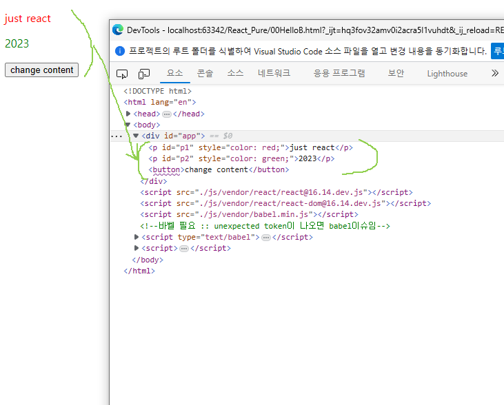
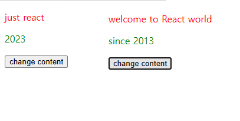

# react
* 리액트는 앱을 구성하는 컴포넌트를 만드는데 사용하는 라이브러리이다

## react-dom 
* react 라이브러리로 만들어진 컴포넌트를 화면에 랜더링해서 사용하는 라이브러리이다.

## JSX
* 리액트는 기존 태그와 다르게 js를 활용하여 UI컴포넌트를 함수의 리턴값으로 사용한다.
* UI컴포넌트(태그)를 리턴하기 위해선 반드시 바벨이 필요하다.
* js공식 문법은 아니지만 요소를 생성하기에 쓰기 편안하고 babel을 통한 과정에서 발생하는 문법적 오류를 인식하기 쉽다.

### 문법
1. 최상위요소는 1개여야함
2. 여러 자식요소 렌더링 시 Fragment를 사용한다.
3. 스타일은{{속성명:'속성값'}}을 사용한다
4. className을 사용해서 class대신에 쓸 수 있다.
5. if문 사용불가! (삼항연산 및 && 사용)


### 사용방법(기본 컴포넌트)
+ 기본세팅 
1. 리액트 라이브러리 https://unpkg.com/react@16/umd/react.development.js
2. 리액트-돔 라이브러리 https://unpkg.com/react-dom@16/umd/react-dom.development.js
3. 바벨 https://unpkg.com/@babel/standalone/babel.min.js

+ 정의 컴포넌트 호출 툴
```javascript
    // 컴포넌트 선언
    const App =()=>{
        return (
            <Fragment>
                추가될 컴포넌트
            </Fragment>
        );
    };

    //위에서 정의한 컴포넌트 호출
    ReactDOM.render(<App />,document.getElementById('app'));
```

```html
<!DOCTYPE html>
<html lang="en">
<head>
    <meta charset="UTF-8">
    <title>My first html page</title>
</head>
<body>
    <div id="app"></div>

    <script src="https://unpkg.com/react@16/umd/react.development.js"></script>
    <script src="https://unpkg.com/react-dom@16/umd/react-dom.development.js"></script>
    <script src="https://unpkg.com/@babel/standalone/babel.min.js"></script>
    <!--바벨 필요 :: unexpected token이 나오면 babel이슈임-->
    <script type="text/babel">
        // 리액트 라이브러리에서 빼올 것
        // 단일 태그를 div로 감싸기 싫을때 사용하는 것
        const {Fragment} = React;
        const App =()=>{
            return (
                // 일종의 컴포넌트라고 보면 됨 (UI를 컴포넌트로 정의)
                // return은 단일 태그(하나의 요소)만 가능하다.(UI 리턴 시)
                <Fragment>
                    <p id="p1" style={{color: 'red'}}>just react</p>
                    <p id="p2" style={{color: 'green'}}>2023</p>
                    <button>change content</button>
                </Fragment>
            );
        };
        //위에서 정의한 컴포넌트 호출
        ReactDOM.render(<App />,document.getElementById('app'));
    </script>
</body>
</html>
```
> 결과  <br>
>  <br>

### 사용방법(이벤트)
* 이벤트 중 텍스트를 바꾸는 이벤트를 하려면, 
* useState를 사용하여 텍스트 값을 변경시킨다.
* useState는 React라이브러리에서 가져와서 const [변수명, setter] = useState('초기값') 형식으로 사용한다.
* 또한, 이벤트를 걸땐 onClick을 활용하여 {이벤트 변수명}을 들고와서 사용하면 된다.
```html
<!DOCTYPE html>
<html lang="en">
<head>
    <meta charset="UTF-8">
    <title>My first html page</title>
</head>
<body>
    <div id="app"></div>

    <script src="./js/vendor/react/react@16.14.dev.js"></script>
    <script src="./js/vendor/react/react-dom@16.14.dev.js"></script>
    <script src="./js/vendor/babel.min.js"></script>
    <script type="text/babel">
        //리액트 모듈에서 뽑아 씀
        const {Fragment,useState} = React;
        const App =()=>{
            //const [변수명, setter] = useState('초기값');
            const [p1text, setP1text] = useState('just react');
            const [p2text, setP2text] = useState('2023');
            
            //이벤트 선언
            const changeContent = ()=>{
                setP1text('welcome to React world');
                setP2text('since 2013');
            }

            return (
                <Fragment>
                    <p id="p1" style={{color: 'red'}}>{p1text}</p>
                    <p id="p2" style={{color: 'green'}}>{p2text}</p>
                    // 이벤트 적용
                    <button onClick={changeContent}>change content</button>
                </Fragment>
            );
        };
        //위에서 정의한 컴포넌트 호출
        ReactDOM.render(<App />,document.getElementById('app'));
        
    </script>
</body>
</html>
```
> 결과  <br>
>  <br>


### 사용방법(스타일)
* 리액트는 기존 class와 다르게 className을 사용하여 클래스명을 지정할 수 있다.
* inline style이 아닌 css파일을 따로 적용하려면 className을 통해 요소들을 구분하는 것이 좋다.
```html

<!DOCTYPE html>
<html lang="en">
<head>
    <meta charset="UTF-8">
    <title>My first html page</title>
    <style>
        .P1{
            color: red;
        }
        .P2{
            color: green;
        }
    </style>
</head>
<body>
    <div id="app"></div>

    <script src="./js/vendor/react/react@16.14.dev.js"></script>
    <script src="./js/vendor/react/react-dom@16.14.dev.js"></script>
    <script src="./js/vendor/babel.min.js"></script>

    <script type="text/babel">

        const {Fragment,useState} = React;
        const App =()=>{

            const [p1text, setP1text] = useState('just react');
            const [p2text, setP2text] = useState('2023');

            const changeContent = ()=>{
                setP1text('welcome to React world');
                setP2text('since 2013');
            }

            return (

                <Fragment>
                    // 클래스 설정 
                    <p id="p1" className="P1">{p1text}</p>
                    <p id="p2" className="P2">{p2text}</p>
                    <button onClick={changeContent}>change content</button>
                </Fragment>
            );
        };
        ReactDOM.render(<App />,document.getElementById('app'));


    </script>
</body>
</html>

```