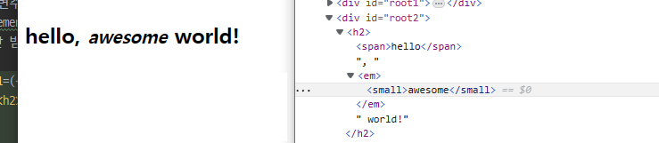

# react
* 리액트는 앱을 구성하는 컴포넌트를 만드는데 사용하는 라이브러리이다

## 문법
1. 최상위요소는 1개여야함
2. 여러 자식요소 렌더링 시 Fragment를 사용한다.
3. 스타일은{{속성명:'속성값'}}을 사용한다
4. className을 사용해서 class대신에 쓸 수 있다.
5. if문 사용불가! (삼항연산 및 && 사용)

## react-dom 
* react 라이브러리로 만들어진 컴포넌트를 화면에 랜더링해서 사용하는 라이브러리이다.
### createElement 
* 만들고 싶은 요소를 지정해서 만들 수 있다.
* createElement(요소, 속성, 내용, 자식요소) 형식으로 사용한다.
```html

<!DOCTYPE html>
<html lang="ko">
<head>
    <meta charset="UTF-8">
    <title>React.createElement</title>
    <style>
        .root2 {
            color: orange;
        }
        #root3{
            color: red;
            font-style: italic;
        }
    </style>
</head>
<body>
<div id="root1"></div>
<div id="root2"></div>
<div id="root3"></div>
<div id="root4"></div>
<div id="root5"></div>

<script src="./js/vendor/react/react@16.14.dev.js"></script>
<script src="./js/vendor/react/react-dom@16.14.dev.js"></script>

<script>
    //createElement(요소, 속성, 내용, 자식요소)
    //render(대상요소, dom요소)
    ReactDOM.render(
        React.createElement('h1',null, 'hello world!'),
        document.querySelector('#root1'));
    ReactDOM.render(
        React.createElement('h1',{className : 'root2'}, 'hello world!'),
        document.querySelector('#root2'));
    ReactDOM.render(
        React.createElement('h2',{id : 'root3'},
            React.createElement('span',null,'hello'), ', world!!'),
        document.querySelector('#root3'));
    ReactDOM.render(
        React.createElement('h2',null,
            //span의 자식요소로 em 넣어보기
            React.createElement('span',null,'hello',React.createElement('em',null,' wonderful')),' world!' ),
        document.querySelector('#root4'));
     ReactDOM.render(
            React.createElement('h3',{className :'abc', style:{textAlign:'center'}, onClick:()=>{alert(`Hello, again!!`)}}, ' hello, another world!' ),
            document.querySelector('#root5'));
</script>
</body>
</html>

```


### render 
* 선언한 대상을 dom요소로 접합할 수 있다.
* render(대상요소, dom요소) 형식으로 사용한다.

## JSX
* 리액트는 기존 태그와 다르게 js를 활용하여 UI컴포넌트를 함수의 리턴값으로 사용한다.
* UI컴포넌트(태그)를 리턴하기 위해선 반드시 바벨이 필요하다.
* js공식 문법은 아니지만 요소를 생성하기에 쓰기 편안하고 babel을 통한 과정에서 발생하는 문법적 오류를 인식하기 쉽다.
* JSX는 반드시 바벨을 통한 트랜스파일링이 필요하다.

### compiling , transpiling
1. compiling 
+ 특정 언어로 작성된 소스코드를 다른 언어로 변환하는 것을 의미 (e.g. Java-> bytecode)
2. transpiling
+ 특정 언어로 작성된 소스코드를 비슷한 수준의 추상화를 가진 다른 언어로 변환하는 것을 의미 (e.g. JS EMCA6 => JS EMCA5 :: babel)
3. Babel
+ 모든 브라우저가 ES6를 지원하지 않기 때문에 이를 ES5코드로 변환시키는 과정이 필요하다.


### 사용방법
#### 기본 컴포넌트
+ 기본세팅 
1. 리액트 라이브러리 https://unpkg.com/react@16/umd/react.development.js
2. 리액트-돔 라이브러리 https://unpkg.com/react-dom@16/umd/react-dom.development.js
3. 바벨 https://unpkg.com/@babel/standalone/babel.min.js

+ 정의 컴포넌트 호출 툴
```javascript
    // 컴포넌트 선언
    const App =()=>{
        return (
            <Fragment>
                추가될 컴포넌트
            </Fragment>
        );
    };

    //위에서 정의한 컴포넌트 호출
    ReactDOM.render(<App />,document.getElementById('app'));
```

* JSX에서 return되는 값은 반드시 단일요소의 태그로 반환되어야하는데,
* 이때, 감싸고 싶지 않다면 fragment를 사용하면 되고 
* <fragmement></fragment> 혹은 <></> 이렇게 표현하면 된다.
```html
<!DOCTYPE html>
<html lang="en">
<head>
    <meta charset="UTF-8">
    <title>My first html page</title>
</head>
<body>
    <div id="app"></div>

    <script src="https://unpkg.com/react@16/umd/react.development.js"></script>
    <script src="https://unpkg.com/react-dom@16/umd/react-dom.development.js"></script>
    <script src="https://unpkg.com/@babel/standalone/babel.min.js"></script>
    <!--바벨 필요 :: unexpected token이 나오면 babel이슈임-->
    <script type="text/babel">
        // 리액트 라이브러리에서 빼올 것
        // 단일 태그를 div로 감싸기 싫을때 사용하는 것
        const {Fragment} = React;
        const App =()=>{
            return (
                // 일종의 컴포넌트라고 보면 됨 (UI를 컴포넌트로 정의)
                // return은 단일 태그(하나의 요소)만 가능하다.(UI 리턴 시)
                <Fragment>
                    <p id="p1" style={{color: 'red'}}>just react</p>
                    <p id="p2" style={{color: 'green'}}>2023</p>
                    <button>change content</button>
                </Fragment>
            );
        };
        //위에서 정의한 컴포넌트 호출
        ReactDOM.render(<App />,document.getElementById('app'));
    </script>
</body>
</html>
```
> 결과  <br>
>  <br>

#### 사용방법(이벤트)
* 이벤트 중 텍스트를 바꾸는 이벤트를 하려면, 
* useState를 사용하여 텍스트 값을 변경시킨다.
* useState는 React라이브러리에서 가져와서 const [변수명, setter] = useState('초기값') 형식으로 사용한다.
* 또한, 이벤트를 걸땐 onClick을 활용하여 {이벤트 변수명}을 들고와서 사용하면 된다.
```html
<!DOCTYPE html>
<html lang="en">
<head>
    <meta charset="UTF-8">
    <title>My first html page</title>
</head>
<body>
    <div id="app"></div>

    <script src="./js/vendor/react/react@16.14.dev.js"></script>
    <script src="./js/vendor/react/react-dom@16.14.dev.js"></script>
    <script src="./js/vendor/babel.min.js"></script>
    <script type="text/babel">
        //리액트 모듈에서 뽑아 씀
        const {Fragment,useState} = React;
        const App =()=>{
            //const [변수명, setter] = useState('초기값');
            const [p1text, setP1text] = useState('just react');
            const [p2text, setP2text] = useState('2023');
            
            //이벤트 선언
            const changeContent = ()=>{
                setP1text('welcome to React world');
                setP2text('since 2013');
            }

            return (
                <Fragment>
                    <p id="p1" style={{color: 'red'}}>{p1text}</p>
                    <p id="p2" style={{color: 'green'}}>{p2text}</p>
                    // 이벤트 적용
                    <button onClick={changeContent}>change content</button>
                </Fragment>
            );
        };
        //위에서 정의한 컴포넌트 호출
        ReactDOM.render(<App />,document.getElementById('app'));
        
    </script>
</body>
</html>
```
> 결과  <br>
>  <br>


#### 사용방법(스타일)
* 리액트는 기존 class와 다르게 className을 사용하여 클래스명을 지정할 수 있다.
* inline style이 아닌 css파일을 따로 적용하려면 className을 통해 요소들을 구분하는 것이 좋다.
```html
<!DOCTYPE html>
<html lang="en">
<head>
    <meta charset="UTF-8">
    <title>My first html page</title>
    <style>
        .P1{
            color: red;
        }
        .P2{
            color: green;
        }
    </style>
</head>
<body>
    <div id="app"></div>

    <script src="./js/vendor/react/react@16.14.dev.js"></script>
    <script src="./js/vendor/react/react-dom@16.14.dev.js"></script>
    <script src="./js/vendor/babel.min.js"></script>

    <script type="text/babel">

        const {Fragment,useState} = React;
        const App =()=>{

            const [p1text, setP1text] = useState('just react');
            const [p2text, setP2text] = useState('2023');

            const changeContent = ()=>{
                setP1text('welcome to React world');
                setP2text('since 2013');
            }

            return (

                <Fragment>
                    // 클래스 설정 
                    <p id="p1" className="P1">{p1text}</p>
                    <p id="p2" className="P2">{p2text}</p>
                    <button onClick={changeContent}>change content</button>
                </Fragment>
            );
        };
        
        //react DOM에서 제공하는 메서드
        ReactDOM.render(<App />,document.getElementById('app'));


    </script>
</body>
</html>

```


## React Components
* 리액트는 컴포넌트화 시켜 필요한곳에 불러올 수 있다.
* createElement 를 통해 요소를 생성할 수도 있지만, JSX를 활용하여 컴포넌트를 바로 들고올 수 있다.
* JSX컴포넌트는  html과 비슷하게 보이지만, javascript와 같게 사용할 수 있다. 
* 따라서, style에 들어갈 내용들 또한 js에서 사용하는 카멜표기법을 활용해서 작성 할 수 있다.
```javascript
   const Food1 =()=>{
        return(
            <section id ="baked-salmon">
                <h1>구운연어</h1>
                <ul className="ingredients">
                    <li>연어 500그램</li>
                    <li>잣 1 컵</li>
                    <li>버터 상추 2 컵</li>
                    <li>옐로 스쿼시(Yellow Squash, 호박의 한 종류) 1개</li>
                    <li>올리브 오일 1/2 컵</li>
                    <li>마늘 3 쪽</li>
                </ul>
                <section className="instruction">
                    <h2>조리절차</h2>
                    <p> 오븐을 350도로 예열한다.</p>
                    <p> 유리 베이킹 그릇에 올리브 오일을 두른다.</p>
                    <p> 연어, 마늘, 잣을 그릇에 담는다.</p>
                    <p> 오븐에서 15분간 익힌다.</p>
                    <p> 옐로 스쿼시를 추가하고 다시 30분간 오븐에서 익힌다.</p>
                    <p> 오븐에서 그릇을 꺼내서 15분간 식힌다음에 상추를 곁들여서 내놓는다.</p>
                </section>
            </section>
        )
    }

    ReactDOM.render(<Food1 />,document.querySelector('#root1'));
```

### 반복문 
* 리액트에서 컴포넌트를 반복하는방법은 map함수를 사용하는 것이다.
* 따라서 다음과 같은 배열형 데이터에 대해서 컴포넌트를 반복시킬 수 있다.
* 리액트에서 반복문은 map함수만 사용한다.
```javascript
    const items = [
        "연어 500그램",
        "잣 1 컵",
        "버터 상추 2 컵",
        "옐로 스쿼시(Yellow Squash, 호박의 한 종류) 1개",
        "올리브 오일 1/2 컵",
        "마늘 3 쪽"
    ]

    const instructs = [
        "오븐을 350도로 예열한다.",
        "유리 베이킹 그릇에 올리브 오일을 두른다.",
        "연어, 마늘, 잣을 그릇에 담는다.",
        "오븐에서 15분간 익힌다.",
        "옐로 스쿼시를 추가하고 다시 30분간 오븐에서 익힌다.",
        "오븐에서 그릇을 꺼내서 15분간 식힌다음에 상추를 곁들여서 내놓는다."
    ];

    let Food2=()=>{
        let menu = '구운연어';
        // 코드블럭 사용 시 작동안함.
        let itemsJSX= items.map((e,i)=><li key={i}>{e}</li>);
        let instructsJSX= instructs.map((e,i)=> <p key={i}>{e}</p>)
        return (
            <section id ="baked-salmon">
                <h1>{menu}</h1>
                <ul className="ingredients">
                    {itemsJSX}
                </ul>
                <section className="instruction">
                    <h2>조리절차</h2>
                    {instructsJSX}
                </section>
            </section>
        )
    }

    ReactDOM.render(<Food2 />,document.querySelector('#root2'));
```

## arguments 
* JSX안에서도 외부로부터 내부에 argument를 넘길 수 있다.
* 받는 형식은 {변수명}이고 넘기는 형식은 변수명=넘길값 이다.
* 여러값의 arguement를 받을 경우 파라미터 위치의 {}안에 컴마로 구분하면된다
+ 예(변수 한개만 받기)
```javascript
    const Hello1=({name})=>{
        return <h2><span>hello</span>, <em>{name}</em> world!</h2>;
    }
    
    ReactDOM.render(<Hello1 name='fabulous' />,document.querySelector('#root1'));
```
+ 예(여러 값을 받기)
```javascript
    const Hello2=({name,color})=>{
        return <h2><span>hello</span>, <em className={color}>{name}</em> world!</h2>;
    }
    
    ReactDOM.render(<Hello2 name ='impressive' color='red' />,document.querySelector('#root3'));
```
* 태그안에 태그를 찍어서 보내고 싶다면 다음과 같이 {}안에 넣어 자바스크립트인것을 보여주면 된다.
```javascript
    const Hello1=({name})=>{
        return <h2><span>hello</span>, <em>{name}</em> world!</h2>;
    }
    
    ReactDOM.render(<Hello1 name={<small>awesome</small>} />,document.querySelector('#root2'));
```
> 결과  <br>
>  <br>


### Props
* 컴퍼넌트 내부에 전달하는 인수임
* 랜더이벤트 발생시점은 내부 값이 바뀌면 실행됨
* 외부에서 컴포넌트로 넘겨주는 argument를 props라고 함 
* 변수명 자체로 사용할 수 있고  인수가 여러개인 경우 하나의 props로 받아(전개) 
* props를 컴포넌트 내부에서 출력할 때 {props.변수명} 형태의 객체형식으로 출력하면 된다.
```javascript
    const Hello3=(props)=>{
        // 객체로 전달받아서 사용함
        return <h2><span>hello</span>, <em className={props.color} style={{backgroundColor:props.style}}>{props.name}</em> world!</h2>;
    }
    
    ReactDOM.render(<Hello3 name ='wonderful' color='green' style='yellow' />,document.querySelector('#root5'));
```
> 결과  <br>
>  <br>

* 만약, 기본속성을 정의하려면 defaultProps를 이용하면 된다.

```javascript
   const Hello3=(props)=>{
        // 객체로 전달받아서 사용함
        return <h2><span>hello</span>, <em className={props.color} style={{backgroundColor:props.style}}>{props.name}</em> world!</h2>;
    }

    Hello3.defaultProps={
        name : 'great',
        color : 'red',
        style : 'black'
    }
    
    ReactDOM.render(<Hello3 />,document.querySelector('#root6'));
```
> 결과  <br>
>  <br>

* 기본 속성을 정의하면 다음과 같이 추가된 값에 대해서만 정의하고 나머지는 기본속성을 이용하게 된다.
```javascript
    const Hello3=(props)=>{
        // 객체로 전달받아서 사용함
        return <h2><span>hello</span>, <em className={props.color} style={{backgroundColor:props.style}}>{props.name}</em> world!</h2>;
    }

    Hello3.defaultProps={
        name : 'great',
        color : 'red',
        style : 'black'
    }
    
    ReactDOM.render(<Hello3 color='pink' name='react'/>,document.querySelector('#root6'));
```
> 결과  <br>
>  <br>

* props를 활용하여 다음과 같이 data를 넣고 엘리먼트를 반복시킬 수 도있다.
```javascript
    const items = [
        "연어 500그램",
        "잣 1 컵",
        "버터 상추 2 컵",
        "옐로 스쿼시(Yellow Squash, 호박의 한 종류) 1개",
        "올리브 오일 1/2 컵",
        "마늘 3 쪽"
    ]

    const instructs = [
        "오븐을 350도로 예열한다.",
        "유리 베이킹 그릇에 올리브 오일을 두른다.",
        "연어, 마늘, 잣을 그릇에 담는다.",
        "오븐에서 15분간 익힌다.",
        "옐로 스쿼시를 추가하고 다시 30분간 오븐에서 익힌다.",
        "오븐에서 그릇을 꺼내서 15분간 식힌다음에 상추를 곁들여서 내놓는다."
    ];

    let Food1=(props)=>{
        // 코드블럭 사용 시 작동안함.
        let itemsJSX= props.item.map((e,i)=><li key={i}>{e}</li>);
        let instructsJSX = props.inst.map((e,i)=> <p key={i}>{e}</p>)
        return (
            <section id ="baked-salmon">
                <h1>{props.menu1}</h1>
                <ul className="ingredients">
                    {itemsJSX}
                </ul>
                <section className="instruction">
                    <h2>{props.menu2}</h2>
                    {instructsJSX}
                </section>
            </section>
        )
    }

    ReactDOM.render(<Food1 item= {items} inst={instructs} menu1='구운연어' menu2='조리절차' />,document.querySelector('#root1'));

```
> 결과  <br>
>  <br>


## State
* 컴포넌트의 상태를 나타내는 값으로 컴포넌트를 외부에 보여줘야 할 때 사용 하며, 컴포넌트 내에서 지속적인 변경이 발생하는 값을 관리하기위해 사용 한다.
* State값이 변경되면 react는 변경된 부분만 자동으로 재 랜더링한다.
* props와 차이는 내용과 성격을 바꾸는 것의 차이 이다. (props는 성격만 바꿈 : e.g. backgound-color , color등 html에 들어갈 수 있는 속성만 변경) (readOnly)
* state는 실제 외부로 보여지는 값을 바꾼다. (e.g. 댓글 수 , 방문자 수 출력)(가변형)
* useState함수를 사용하면 된다. useState는 초기변수명, set초기변수명으로 표기하는데, 내용을 바꿀땐 set초기변수명을 바꾼다.
* useState는 반드시 리액트라이브러리에서 모듈을 끌고 와야 사용 가능하다.
* useState의 변수명은  read-Only이고, set변수명은 write-Only이다.

```javascript
    const {useState, Fragment} =  React;

    const Counter = ()=>{
        const [cnt,setCnt]=useState(0);
        return (
            //빈 태그는 Fragment를 의미한다.
            <>
                <p>count : {cnt}</p>
                <div><button type="button" onClick={()=>setCnt(cnt+1)}>가드를 올려요</button></div>
            </>
        );
    }
    
    ReactDOM.render(<Counter />,document.querySelector('#root1'));
```
> 결과  <br>
>  <br>


## 클래스 기반
## 함수기반
* 현재 더 권고되고있는 상황임
* Life-cycle hook이 지원되면서 함수기반의 사용이 권고됨
